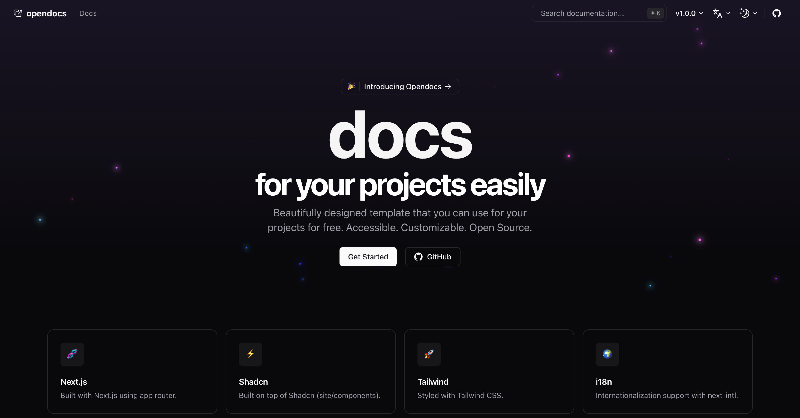

# opendocs

> Next.js beautifully designed template that you can use for your projects for free with site, blog and docs support. Accessible. Customizable. Open Source.

  

  <!-- GitHub -->
  
  <!-- Patreon -->
  
  <!-- Version -->
  
  <!-- License -->
  

## 🎉 Features
- 🕸️ Site
- 📄 Docs
- ✍️ Blog
  - 🔖 Tags
  - 📟 Pagination
  - 🍕 RSS Feed 2.0 (xml and json)
  - ⏱️ Minutes read time estimation
  - 🧬 Dynamic or provided OG images for blog posts
- 🌎 i18n
- 💬 MDX
- 📍 Sitemap
- 🔍 SEO
- 🌓 Dark/Light mode
- 💅 Tailwind CSS
- 🧱 Shadcn components
- 📐 Responsive
- 🧬 Accessible
- 🤖 Customizable
- 🚀 Open Source

and more...

## 📌 ToDo
- [ ] versioning docs support

## 📄 Documentation

Visit https://opendocs.daltonmenezes.com/docs to view the documentation.

## 💬 Contributing
> **Note**: contributions are always welcome, but always **ask first**, — please — before work on a PR.

That said, there's a bunch of ways you can contribute to this project, like by:

- :beetle: Reporting a bug
- :page_facing_up: Improving the docs
- :rotating_light: Sharing this project and recommending it to your friends
- :dollar: Supporting this project on GitHub Sponsors or Patreon
- :star2: Giving a star on this repository

## License

Licensed under the [MIT license](https://github.com/daltonmenezes/opendocs/blob/main/LICENSE.md).
